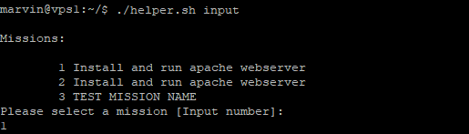
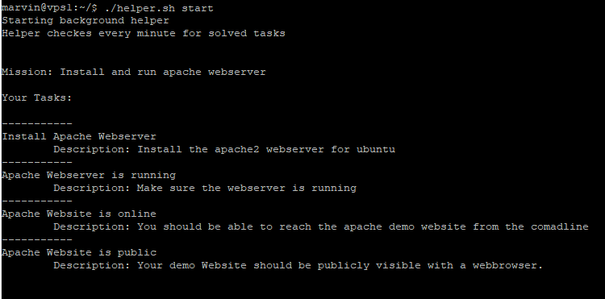
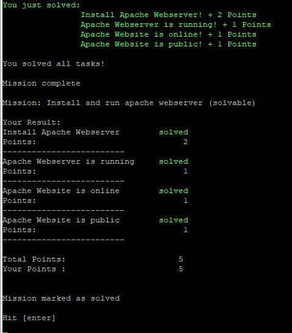

# linux admin game
> Learn linux while solving interactive sysadmin missions!

[](https://travis-ci.org/6uhrmittag/linux-admin-tutor)

The Linux admin game helps you to learn linux admin tasks like installing a webserver or updateing the system.
You'll get missions and tasks to solve and hints on how to solve the mission. 

## Installation

Requirements:
- Ubuntu
- sudo
- fresh VM

Note: Please use this game on a fresh VM, that you can delete later, only. You'll modify the system.

```sh
git clone https://github.com/6uhrmittag/linux-admin-game.git
cd linux-admin-game
sudo ./setup.sh
./helper input (select your mission here)
./helper start (start the mission)
```

## Usage example
Select your mission:


View your tasks:


Get your result:



## Development setup

To run a test for all missions run `./game.sh testing`. 
Run this on a fresh VM/CI only. testing mode installs/executes all mission tasks.

generate documentation:
```sh
make doku
```

## Meta

Marvin Heimbrodt – [@6uhrmittag](https://twitter.com/6uhrmittag) – marvin@6uhrmittag.de

(***TODO***) Distributed under the XYZ license. See ``LICENSE`` for more information.

[https://slashlog.de/](slashlog.de)

## Contributing

1. Fork it (<https://github.com/6uhrmittag/linux-admin-tutor/fork>)
2. Create your feature branch (`git checkout -b feature/fooBar`)
3. Commit your changes (`git commit -am 'Add some fooBar'`)
4. Push to the branch (`git push origin feature/fooBar`)
5. Create a new Pull Request

## Add missions

1. Fork it (<https://github.com/6uhrmittag/linux-admin-tutor/fork>)
2. Create your mission branch (`git checkout -b mission/fooBar`)
3. Add your mission using the template
4. Please make sure all tasks are solvable! (Travis should be able to check the "test" sections)
5. Commit your changes (`git commit -am 'Add some fooBar'`)
6. Push to the branch (`git push origin mission/fooBar`)
7. Create a new Pull Request

## Acknowledgments

* [Lynis - Security auditing tool](https://github.com/CISOfy/lynis) - inspired the game mode
* [shdoc - Documentation generator for shell scripts](https://github.com/reconquest/shdoc) - used for documentation